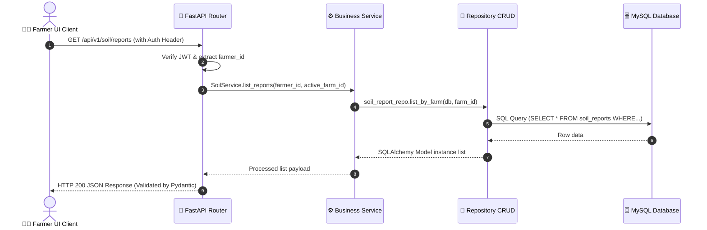
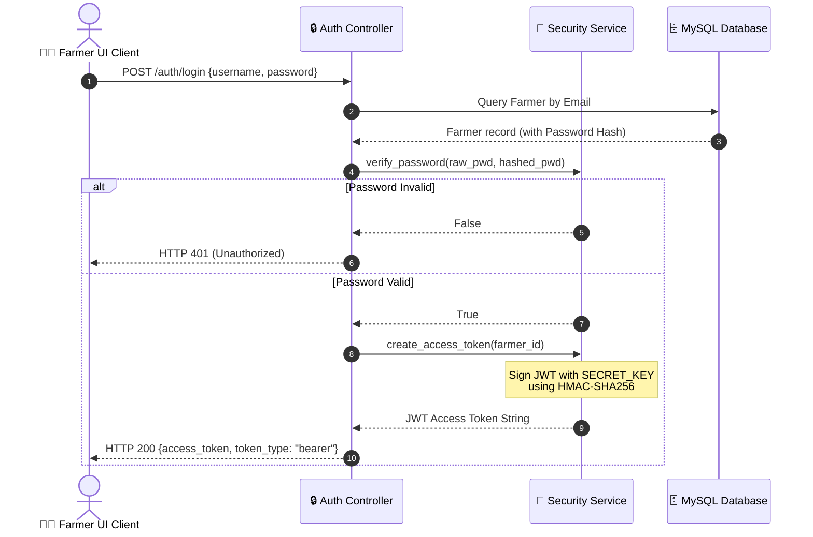
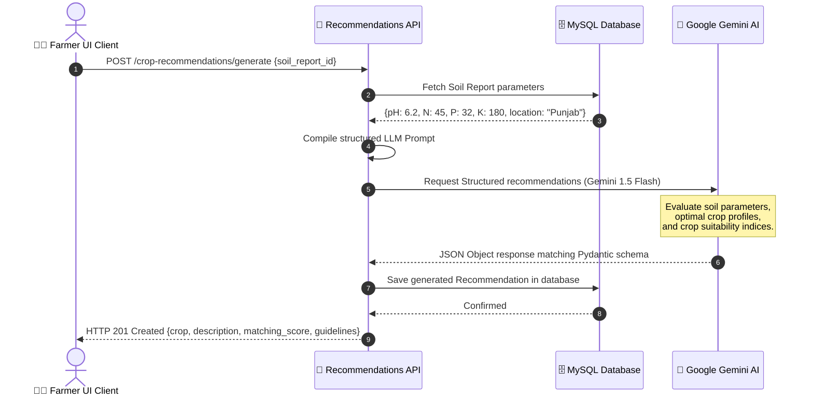
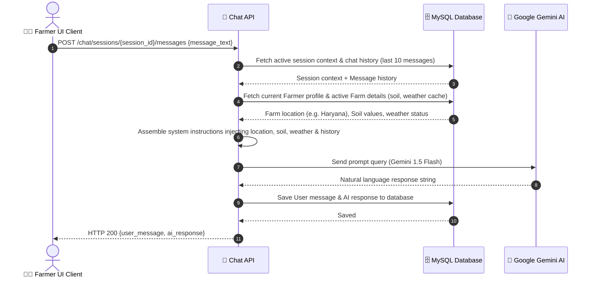

# AgriAssist AI: Architecture & System Design Document

This document provides a comprehensive technical overview of the AgriAssist AI software architecture, database relations, AI workflows, and request processing pipelines.

---

## 1. System Overview

AgriAssist AI is structured as a decoupled, multi-tier Web Platform designed using the client-server architectural model.

```
┌────────────────────────────────────────────────────────┐
│                      Client Layer                      │
│             React Single Page Application              │
└──────────────────────────┬─────────────────────────────┘
                           │ HTTP REST / JSON
                           ▼
┌────────────────────────────────────────────────────────┐
│                   Application Layer                    │
│             FastAPI Backend Server Engine              │
└──────────────┬───────────────────────────┬─────────────┘
               │ SQLAlchemy ORM            │ HTTP API
               ▼                           ▼
┌──────────────────────────┐   ┌─────────────────────────┐
│     Database Layer       │   │     Cognitive Layer     │
│    MySQL RDBMS Server    │   │  Gemini AI (Flash 1.5)  │
└──────────────────────────┘   └─────────────────────────┘
```

* **Client Layer**: A responsive React SPA styled with earthen-emerald HSL CSS design tokens.
* **Application Layer**: A high-performance FastAPI server engine organizing API endpoints into routers.
* **Database Layer**: A relational MySQL database storing structured profiles, soil charts, analytics, and plans.
* **Cognitive Layer**: Google Gemini AI model integrated to perform structured diagnosis and reasoning.

---

## 2. Dynamic Workflow Diagrams

### 2.1 Request Processing Pipeline
Describes the lifecycle of a frontend UI event query requesting data.



---

### 2.2 JWT Authentication & Session Security Flow
Details client registration, login validation, token issuance, and subsequent authenticated requests.



---

### 2.3 AI Crop Recommendation Flow
Illustrates how NPK soil parameters and regional parameters map to recommendations.



---

### 2.4 Virtual Agronomist Consultation Chat Flow
Maps user dialog to conversation sessions, context building, database audits, and response caches.



---

## 3. Database Architecture & Relationships

AgriAssist AI operates on a relational schema designed to guarantee clean referential integrity:

* **Farmers**: Central account table. Holds JWT hashes, profile parameters, default configurations, and active farm context pointers.
* **Farms**: Multi-farm portfolio container. Connects soil reports, crop plans, predicted yields, analytics snapshots, and alerts under a specific farm context.
* **Soil Reports**: Captures chemical soil tests (NPK, pH, tested date) linked directly to a farm.
* **Disease Scans**: Holds photo uploads, diagnostic analysis, leaf type, confidence scoring, and treatment options.
* **Farm Plans**: Sowing calendars holding a list of sequential tasks (`FarmTasks`) with completion markers and snoozing support.
* **Notifications**: Central alert logging table supporting soft-deletions for idempotency.
